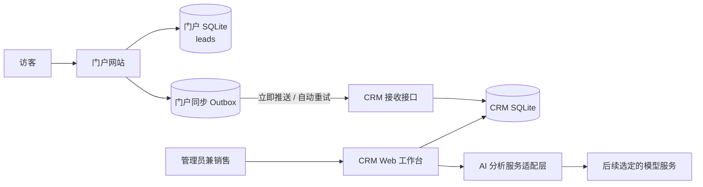
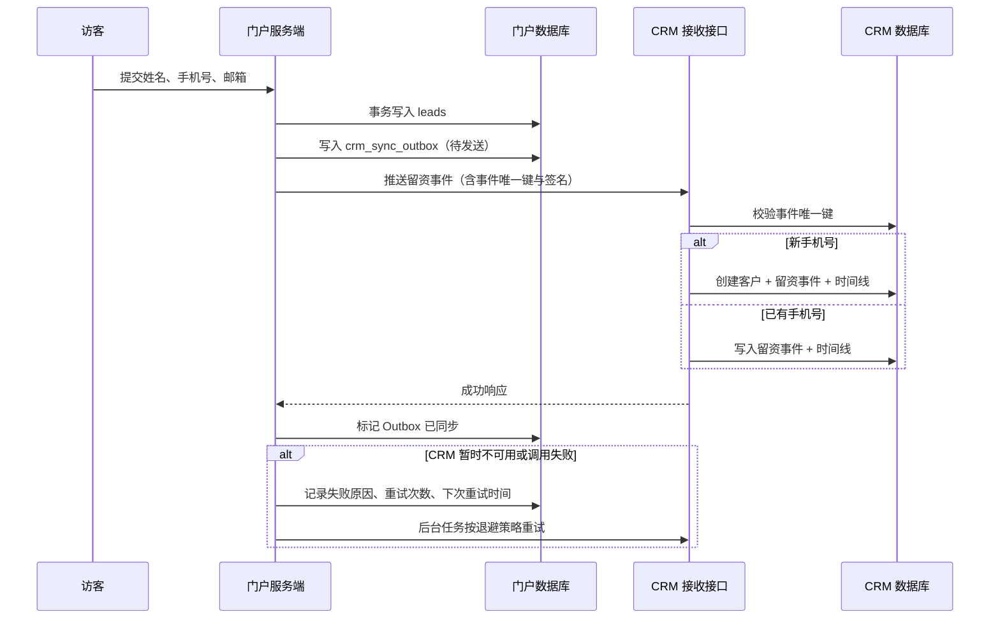
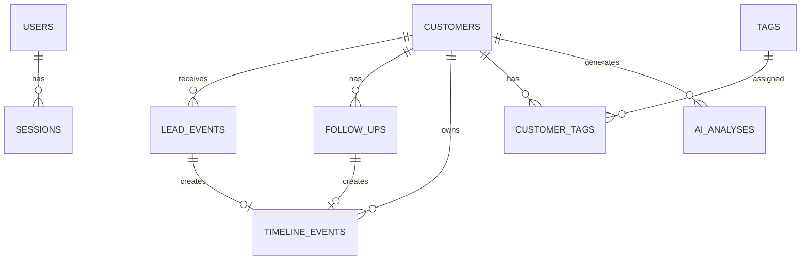

# 元川 AI 轻量级 CRM 技术方案

| 项目 | 内容 |
| --- | --- |
| 文档版本 | v1.0（方案评审稿） |
| 依据 | `requirements.md` v1.0 |
| 状态 | 待技术方案确认 |
| 编写日期 | 2026-08-10 |
| 实施范围 | 独立 CRM 系统 + 门户网站留资同步改造 |

---

## 1. 方案结论

建议将 CRM 建设为一个**独立的 Next.js 应用**，与现有门户网站分开部署、分开数据库、通过受保护的服务接口同步数据。

第一期采用与门户一致的技术生态：**Next.js + TypeScript + Tailwind CSS + SQLite**。这是基于“单用户、轻量级、低并发”的当前范围做出的选择；CRM 数据库开启 WAL、外键约束、定期备份。若未来进入多人协作或高频并发场景，再将 CRM 数据库迁移至 PostgreSQL。

门户与 CRM 之间不采用“仅调用一次、失败即放弃”的同步方式，而采用：

1. 门户先完成本地留资保存；
2. 门户将待同步事件写入本地 **Outbox（发件箱）**；
3. 门户立即调用 CRM 留资接收接口；
4. 失败任务由门户自动重试，CRM 提供查询与人工重试入口；
5. CRM 使用事件唯一键做幂等校验，避免网络重试导致重复客户或重复时间线。

这样可以同时满足“正常情况下实时出现”和“异常情况下不丢失、不重复”的要求。

---

## 2. 架构设计

### 2.1 系统边界



### 2.2 职责划分

| 系统 | 保留职责 | 新增/改造职责 |
| --- | --- | --- |
| 门户网站 | 展示门户、收集留资、保存原始线索 | 写入同步 Outbox、即时推送 CRM、失败重试、向 CRM 提供同步异常查询/重试能力。 |
| CRM | 客户经营、跟进、提醒、AI 建议 | 接收门户留资、手机号去重、保留留资事件、提供客户管理与工作台。 |
| AI 模型服务 | 无 | 仅根据用户主动请求生成客户画像和销售建议；不直接写 CRM 数据。 |

### 2.3 关键架构原则

1. **门户数据不迁移替代**：门户保留自身原始 `leads` 数据；CRM 不直接读取门户 SQLite 文件。
2. **CRM 是客户主档**：客户资料、状态、标签、跟进、提醒和 AI 结果均以 CRM 数据库为准。
3. **事件化同步**：每次留资均为一个独立事件；重复客户合并，但事件历史保留。
4. **幂等优先**：同一个门户事件无论推送多少次，在 CRM 中只处理一次。
5. **服务端可信调用**：门户到 CRM 的调用只发生在服务端；不将同步密钥下发给浏览器。
6. **AI 可插拔**：业务层只依赖 AI 适配接口，具体模型和供应商通过配置替换。

---

## 3. 技术选型

| 层级 | 选型 | 选择理由 |
| --- | --- | --- |
| CRM Web 框架 | Next.js 16（App Router） | 与现有门户技术栈一致；同一项目可提供页面、服务端逻辑与受保护接口。 |
| 语言 | TypeScript | 约束客户状态、接口载荷与数据库字段，降低后续维护风险。 |
| UI | React + Tailwind CSS | 保持轻量、快速构建后台界面。 |
| 数据库 | SQLite + better-sqlite3 | 单用户、低并发、部署简单；与门户运行环境兼容。 |
| ORM 与迁移 | Drizzle ORM + drizzle-kit | 类型安全、迁移文件清晰，适合 SQLite 和将来迁移其他数据库。 |
| 表单校验 | Zod + React Hook Form | 前后端共享字段校验规则，减少无效数据入库。 |
| 登录会话 | 数据库 Session + HttpOnly Cookie | 不沿用门户当前 Base64 token 方案；会话可失效、可撤销，浏览器无法读取 Cookie 内容。 |
| 密码哈希 | bcryptjs | 不以明文存储 CRM 密码。 |
| 门户鉴权 | HMAC 签名或固定服务端密钥 | 校验门户请求来源，避免 CRM 接收接口裸露。 |
| 定时任务 | PM2 定时/守护脚本 | 用于门户 Outbox 重试；与现有 Ubuntu + PM2 运维方式兼容。 |
| AI 集成 | Provider Adapter（服务端） | 模型供应商未定，先隔离调用协议、密钥和响应格式。 |
| 测试 | Vitest + Playwright | 覆盖业务规则、接口幂等与关键操作流程。 |

### 3.1 数据库选择说明

CRM 第一阶段使用独立 SQLite 文件，不与门户共用数据库。原因如下：

- 当前仅一个 CRM 使用者，写入量主要来自留资和跟进记录，规模较小。
- 可直接部署在现有 Node.js/PM2 服务器，减少新增服务和运维成本。
- 开启 WAL、设置合理的事务边界后，可满足当前门户同步和单人后台操作。

不适用边界：多人并发编辑、复杂报表、频繁批量导入或高频外部接口调用。出现这些情况时，数据库迁移至 PostgreSQL，但不改变业务模型和 API 语义。

---

## 4. 门户与 CRM 的同步方案

### 4.1 同步时序



### 4.2 为什么需要门户 Outbox

若门户仅在 `POST /api/leads` 中直接调用 CRM，CRM 网络故障会导致两种不可接受的结果：要么阻塞访客留资，要么访客已提交成功但 CRM 永久漏数据。

Outbox 将“保存门户留资”和“创建待同步事件”放进同一门户本地事务。这样，访客体验不依赖 CRM 可用性；同步任务则可独立重试，直到成功或进入人工处理。

### 4.3 门户侧改造

现有门户项目中，拟涉及以下文件（路径以门户项目根目录为基准）：

| 文件 | 改造内容 |
| --- | --- |
| `src/lib/db.ts` | 新增 `crm_sync_outbox` 建表、索引和数据库访问方法。 |
| `src/app/api/leads/route.ts` | 留资成功后，在同一数据库事务中创建 Outbox 事件；随后触发一次非阻塞同步尝试。 |
| `src/lib/crm-sync.ts` | 新增：封装签名、CRM 调用、超时、重试状态更新和幂等事件载荷。 |
| `src/app/api/crm-sync/status/route.ts` | 新增：供 CRM 服务端读取同步异常摘要，必须使用服务间鉴权。 |
| `src/app/api/crm-sync/retry/[id]/route.ts` | 新增：供 CRM 发起某条失败任务人工重试，必须使用服务间鉴权。 |
| `scripts/retry-crm-sync.ts` | 新增：扫描待发送/失败 Outbox，按退避策略重试。 |
| PM2 配置 | 为重试脚本增加独立守护或定时执行配置。 |

### 4.4 门户 Outbox 数据模型

门户 SQLite 新增表 `crm_sync_outbox`，建议字段如下：

| 字段 | 类型/含义 | 说明 |
| --- | --- | --- |
| `id` | 主键 | Outbox 内部编号。 |
| `lead_id` | 门户 `leads.id` | 对应原始留资。 |
| `event_key` | 全局唯一字符串 | 同步幂等键；创建后永不改变。 |
| `payload_json` | JSON | 推送给 CRM 的原始载荷快照。 |
| `status` | pending/syncing/succeeded/failed | 当前同步状态。 |
| `attempt_count` | 整数 | 已尝试次数。 |
| `last_error` | 文本 | 最近一次失败原因。 |
| `next_retry_at` | 时间 | 下次自动重试时间。 |
| `synced_at` | 时间 | 最终同步成功时间。 |
| `created_at`/`updated_at` | 时间 | 审计字段。 |

建议为 `lead_id` 与 `event_key` 设置唯一约束，防止同一条门户线索被重复创建 Outbox 任务。

### 4.5 CRM 接口载荷

接口形态暂定为服务端 `POST /api/integrations/portal/leads`。正式 URL、域名和签名头名称在部署阶段确定。

请求体建议：

```json
{
  "eventKey": "portal-lead-<唯一标识>",
  "portalLeadId": "门户 leads.id",
  "name": "客户姓名",
  "phone": "手机号",
  "email": "邮箱",
  "source": "web",
  "submittedAt": "2026-08-10T10:00:00+08:00"
}
```

请求头建议包括：时间戳、事件键、签名、请求体摘要。CRM 对时间戳窗口和签名进行验证，以减少重放和伪造风险。

### 4.6 异常展示与人工重试

网络失败只能由发送方（门户）最先感知，因此失败任务的权威状态保存在门户 Outbox。

CRM 的“同步异常列表”页面通过服务端调用门户受保护的状态接口获取失败任务摘要；用户点击“重试”时，CRM 服务端调用门户的受保护重试接口。该设计使 CRM 保持统一操作入口，同时避免 CRM 对未收到的原始事件进行猜测或伪造。

---

## 5. CRM 数据模型

### 5.1 实体关系



### 5.2 CRM 表/实体说明

| 实体 | 用途 | 核心字段 |
| --- | --- | --- |
| `users` | CRM 登录用户 | `id`、`username`、`password_hash`、`created_at`。 |
| `sessions` | 可撤销登录会话 | `id`、`user_id`、`token_hash`、`expires_at`、`created_at`。 |
| `customers` | 客户主档 | `id`、`name`、`phone`、`phone_normalized`、`email`、公司/职位/地区/行业、需求、预算、状态、来源、最近/下次跟进时间、归档时间。 |
| `tags` | 可复用标签字典 | `id`、`name`、`created_at`。 |
| `customer_tags` | 客户与标签的多对多关系 | `customer_id`、`tag_id`。 |
| `lead_events` | 每次门户留资的原始事件 | `id`、`event_key`、`portal_lead_id`、`customer_id`、原始姓名/手机号/邮箱、来源、门户提交时间、接收时间。 |
| `follow_ups` | 客户跟进记录 | `id`、`customer_id`、方式、内容、结果、跟进时间、下次跟进时间、状态变更。 |
| `timeline_events` | 统一时间线投影 | `id`、`customer_id`、事件类型、关联实体、展示内容、发生时间、创建时间。 |
| `ai_analyses` | AI 生成历史 | `id`、`customer_id`、输入范围快照、输出 JSON、模型标识、创建时间。 |

### 5.3 `customers` 关键字段与约束

| 字段 | 规则 |
| --- | --- |
| `id` | 文本型 UUID，由服务端生成。 |
| `name` | 非空。 |
| `phone` | 非空，保留原始展示格式。 |
| `phone_normalized` | 非空、唯一；去除空格、横杠、国家码格式后用于匹配。 |
| `email` | 可空；不作为自动合并依据。 |
| `status` | 枚举：`pending`、`following`、`high_intent`、`converted`、`lost`。 |
| `source` | 初始值为 `web` 或 `manual`；保留将来扩展渠道的能力。 |
| `next_follow_up_at` | 可空；用于待办和逾期计算。 |
| `archived_at` | 可空；有值表示软归档。 |

### 5.4 事务边界

以下操作必须在 CRM 单个数据库事务内完成：

1. 接收一条门户留资：写入 `lead_events`、创建或读取客户、写入 `timeline_events`。
2. 新增跟进：写入 `follow_ups`、更新客户最近/下次跟进时间与状态、写入 `timeline_events`。
3. 修改客户资料或状态：更新 `customers` 并写入 `timeline_events`。
4. 分配或移除标签：更新关联表并写入必要的时间线事件。

这样可以保证不会出现“客户创建了但时间线没有记录”或“跟进存在但提醒没有更新”的半完成状态。

---

## 6. CRM 项目文件与组件结构

### 6.1 项目目录

CRM 拟作为独立项目存放在工作区的 `crm/` 目录下。以下为计划结构，均为后续实施时创建，不在本方案阶段生成业务代码。

```text
crm/
├── src/
│   ├── app/
│   │   ├── (auth)/login/page.tsx
│   │   ├── (app)/layout.tsx
│   │   ├── (app)/dashboard/page.tsx
│   │   ├── (app)/customers/page.tsx
│   │   ├── (app)/customers/new/page.tsx
│   │   ├── (app)/customers/[id]/page.tsx
│   │   ├── (app)/sync-errors/page.tsx
│   │   └── api/
│   │       ├── auth/login/route.ts
│   │       ├── auth/logout/route.ts
│   │       ├── customers/route.ts
│   │       ├── customers/[id]/route.ts
│   │       ├── customers/[id]/follow-ups/route.ts
│   │       ├── customers/[id]/ai-analysis/route.ts
│   │       ├── integrations/portal/leads/route.ts
│   │       └── sync-errors/retry/route.ts
│   ├── components/
│   │   ├── layout/
│   │   ├── dashboard/
│   │   ├── customers/
│   │   ├── follow-ups/
│   │   ├── reminders/
│   │   ├── ai/
│   │   ├── sync/
│   │   └── ui/
│   ├── db/
│   │   ├── client.ts
│   │   ├── schema.ts
│   │   ├── migrations/
│   │   └── seed.ts
│   ├── lib/
│   │   ├── auth.ts
│   │   ├── security.ts
│   │   ├── phone.ts
│   │   ├── datetime.ts
│   │   ├── env.ts
│   │   └── errors.ts
│   ├── services/
│   │   ├── customer.service.ts
│   │   ├── follow-up.service.ts
│   │   ├── portal-ingest.service.ts
│   │   ├── reminder.service.ts
│   │   ├── sync-monitor.service.ts
│   │   └── ai.service.ts
│   ├── validators/
│   │   ├── auth.ts
│   │   ├── customer.ts
│   │   ├── follow-up.ts
│   │   ├── portal-event.ts
│   │   └── ai.ts
│   └── types/
│       └── crm.ts
├── tests/
│   ├── unit/
│   ├── integration/
│   └── e2e/
├── drizzle.config.ts
├── package.json
├── .env.example
└── README.md
```

### 6.2 文件职责

| 文件/目录 | 职责 |
| --- | --- |
| `src/app/(app)` | 已登录 CRM 的路由和页面，不放复杂业务逻辑。 |
| `src/app/api` | 浏览器操作接口与门户系统接口；负责鉴权、输入校验、调用服务层。 |
| `src/components` | 可组合的页面展示与表单组件。 |
| `src/db/schema.ts` | CRM 所有数据表、枚举、索引和关联定义。 |
| `src/db/migrations` | 可重复执行的数据库演进记录。 |
| `src/services` | 去重、事务、跟进、提醒、同步、AI 等业务规则的唯一实现位置。 |
| `src/validators` | Zod 请求和表单校验规则；避免不同入口出现不同标准。 |
| `src/lib/security.ts` | 密码哈希、会话 Cookie、门户签名校验等安全能力。 |
| `tests` | 单元、接口集成与关键用户流程测试。 |

### 6.3 前端组件树

```text
AppShell
├── Sidebar
│   ├── DashboardNavItem
│   ├── CustomersNavItem
│   └── SyncErrorsNavItem
├── Topbar
└── PageContent
    ├── DashboardPage
    │   ├── MetricCards
    │   ├── TodayFollowUpList
    │   ├── OverdueList
    │   └── RecentCustomerList
    ├── CustomerListPage
    │   ├── CustomerFilters
    │   ├── CustomerSearch
    │   ├── CustomerTable
    │   └── CustomerFormDialog
    ├── CustomerDetailPage
    │   ├── CustomerProfileCard
    │   ├── CustomerStatusControl
    │   ├── TagEditor
    │   ├── FollowUpForm
    │   ├── CustomerTimeline
    │   ├── ReminderPanel
    │   └── AiInsightPanel
    └── SyncErrorsPage
        ├── SyncErrorTable
        └── RetryAction
```

### 6.4 页面数据加载策略

- 列表、详情、工作台以服务端读取为主，保证登录校验和数据查询在服务端完成。
- 搜索、筛选、表单提交、状态更新和人工重试使用受保护的 Route Handler 或 Server Action。
- 客户详情完成跟进后，局部刷新相关区域，确保时间线、客户状态和提醒状态一致。
- AI 分析采用用户点击后异步请求；页面展示加载状态、成功结果和失败提示。

---

## 7. 核心业务实现思路

### 7.1 手机号规范化与去重

在所有客户创建入口和门户同步入口执行同一手机号规范化函数：

1. 去除首尾空格、空格、横杠与括号。
2. 统一中国手机号常见的 `+86` / `86` 前缀格式。
3. 保存原始手机号用于界面展示，保存规范化手机号用于唯一索引和查询。
4. 数据库为 `phone_normalized` 建唯一索引，应用层查询与数据库约束双重保证。

门户同步时，如果已存在相同规范化手机号，则复用该客户 ID，仅创建 `lead_events` 和时间线事件。

### 7.2 客户资料冲突策略

门户再次留资可能携带与 CRM 档案不同的姓名或邮箱。为避免外部数据覆盖人工维护内容，采用以下推荐策略：

- 任何重复留资均保留原始字段快照到 `lead_events` 和时间线。
- CRM 已有的非空姓名、邮箱不被门户自动覆盖。
- CRM 对应字段为空时，可使用门户新值补全。
- 页面后续可在时间线中提示“新留资字段与当前档案不同”，由用户决定是否更新。

该策略对应 PRD 待决策项 D-03，需在方案确认时一并确认。

### 7.3 提醒计算

不单独创建大量冗余提醒记录，而是由 `customers.next_follow_up_at` 和最新跟进数据计算列表：

- 今天日期相同：今日应跟进。
- 时间小于当前时刻：已逾期。
- 客户状态为待跟进、且尚无下一次时间：待跟进。
- 新增跟进并设置新的下次跟进时间：查询结果自动变化。

这样能避免旧提醒未关闭、同一客户重复出现多条待办的问题。若后续需要多任务或多人分配，再引入独立 `tasks` 表。

### 7.4 时间线投影

时间线不是用户单独编辑的数据，而是由关键业务操作生成的统一展示记录。事件类型包括：

- `customer_created`
- `portal_lead_received`
- `customer_updated`
- `status_changed`
- `follow_up_created`
- `tag_changed`
- `ai_analysis_generated`
- `customer_archived` / `customer_restored`

每个事件保存关联实体 ID、展示文案、结构化元数据和发生时间。这样客户详情可按时间倒序展示完整历史，同时不需要从多张表临时拼装复杂业务文案。

### 7.5 AI 服务适配层

业务代码只调用统一接口：`generateCustomerInsight(input)`。适配层负责：

1. 从客户、留资事件、跟进记录组装受控上下文。
2. 调用配置的 AI 服务端接口。
3. 要求模型返回结构化 JSON：画像、需求、意向、依据、沟通重点、问题、行动建议、话术。
4. 校验模型输出，保存 `ai_analyses` 历史记录。
5. 将 AI 服务密钥、模型名、调用耗时和错误处理限定在服务端。

首期不让 AI 直接更新客户状态、跟进内容或下次跟进时间；页面只提供查看、复制与人工采用。

### 7.6 安全实现要点

- CRM 登录密码使用哈希保存；初始账号和密码从部署环境配置或首次初始化流程提供。
- CRM 页面通过数据库会话和 HttpOnly、Secure、SameSite Cookie 鉴权。
- 门户到 CRM 的接口使用服务端签名校验；签名密钥放在两端的环境变量，不写入前端代码。
- 所有门户事件以 `eventKey` 做唯一约束，签名校验通过后才能进入去重流程。
- AI 密钥只存在 CRM 服务端环境变量中；应用日志不记录完整手机号、邮箱、跟进内容或密钥。
- 正式部署应通过 HTTPS 对外提供 CRM 服务；不能继续使用公开 HTTP 传输客户资料。

---

## 8. 实施步骤

以下步骤按依赖顺序执行。方案确认前不执行。

### 阶段 0：实施前确认与环境准备

1. 确认 CRM 对外访问域名、部署服务器、HTTPS 与端口方案。
2. 确认门户源码可访问并可部署修改。
3. 确认门户与 CRM 的服务端签名密钥管理方式。
4. 确认 AI 服务商、模型、API 密钥和调用预算。
5. 确认待决策项 D-03、D-04、D-05、D-07、D-08。

**产出**：环境变量清单、部署拓扑、最终 API 访问地址。

### 阶段 1：CRM 基础工程与数据层

1. 创建独立 CRM Next.js 工程及基础 UI 框架。
2. 配置 TypeScript、Tailwind、Drizzle、SQLite、环境变量校验。
3. 建立 CRM 数据库迁移：用户、会话、客户、标签、留资事件、跟进、时间线、AI 分析。
4. 创建首个 CRM 管理员账号的安全初始化流程。
5. 建立认证、中间件、日志和错误处理基础能力。

**完成标准**：可登录、受保护页面不可匿名访问、数据库迁移可从空环境重复执行。

### 阶段 2：客户管理与工作台

1. 实现客户新建、编辑、归档、恢复。
2. 实现手机号规范化和唯一约束。
3. 实现客户列表、搜索、组合筛选和客户详情。
4. 实现状态、来源、标签和资料变更时间线。
5. 实现工作台指标与今日/逾期/高意向客户清单。

**完成标准**：不依赖门户数据时，可在 CRM 内完整维护客户和查看待办。

### 阶段 3：跟进、提醒与时间线

1. 实现新增跟进记录与状态变更。
2. 在事务中更新最近跟进、下次跟进时间和时间线。
3. 实现待跟进、今日应跟进、已逾期的计算与展示。
4. 编写关键规则测试：状态变化、时间边界、归档客户过滤。

**完成标准**：跟进后工作台、客户列表和详情页的数据一致。

### 阶段 4：门户可靠同步

1. 在门户数据库增加 `crm_sync_outbox`。
2. 改造门户留资接口：保存 `leads` 和 Outbox 事件。
3. 实现 CRM 留资接收接口、签名验证和事件幂等处理。
4. 实现门户立即推送、重试脚本和退避策略。
5. 实现 CRM 同步异常页面与门户状态/重试接口。
6. 测试新客户、重复手机号、重复事件、CRM 宕机恢复、签名失败等场景。

**完成标准**：门户同步可创建或合并客户；故障恢复后不丢失、不重复。

### 阶段 5：AI 分析能力

1. 定义 AI 输入快照和结构化输出 JSON 协议。
2. 实现服务端 Provider Adapter 与环境变量配置。
3. 实现客户详情 AI 生成、结果展示、复制和历史留存。
4. 测试空资料、仅留资、存在多次跟进、模型超时与无效输出等情况。

**完成标准**：用户可主动生成、阅读、复制 AI 建议；AI 不自动写客户业务数据。

### 阶段 6：质量、部署与交接

1. 完成单元测试、接口测试和端到端关键流程测试。
2. 配置生产环境变量、HTTPS、PM2 进程、日志与数据库备份。
3. 对门户到 CRM 的真实联调进行验证。
4. 使用 PRD 第 11 节验收场景逐项验收。
5. 提供部署说明、日常运维说明和数据恢复说明。

**完成标准**：生产环境可登录、可同步、可跟进、可提醒、可生成 AI 建议，并具备异常定位和恢复路径。

---

## 9. 测试策略

| 测试类别 | 重点内容 |
| --- | --- |
| 单元测试 | 手机号规范化、状态规则、提醒计算、签名验证、AI 输出校验。 |
| 集成测试 | CRM 入站同步幂等、客户合并、事务完整性、认证、跟进更新。 |
| 端到端测试 | 登录、手动建客户、跟进、筛选、提醒、AI 生成、门户留资同步。 |
| 异常演练 | CRM 不可用、门户重试、重复推送、错误签名、AI 超时、数据库锁定。 |
| 人工验收 | 按 `requirements.md` 的 AT-01 至 AT-09 执行。 |

---

## 10. 部署与运维方案

### 10.1 建议部署拓扑

- CRM 使用独立项目目录、独立 SQLite 数据文件和独立 PM2 进程，例如 `yuanchuan-crm`。
- CRM 使用独立域名或子域名，并通过 Nginx/Caddy 反向代理提供 HTTPS。
- 门户仍由既有 `yuanchuan` 进程提供服务；两者仅经服务端接口通信。
- CRM 数据库和门户数据库分别执行定期备份；备份文件不放入 Web 静态目录。

### 10.2 关键环境变量（名称为建议）

| 变量 | 所属系统 | 用途 |
| --- | --- | --- |
| `CRM_DATABASE_PATH` | CRM | CRM SQLite 文件路径。 |
| `CRM_SESSION_SECRET` | CRM | Session 签名/哈希用途。 |
| `PORTAL_SYNC_SECRET` | 门户 + CRM | 服务间请求签名密钥。 |
| `CRM_INGEST_URL` | 门户 | CRM 留资接收接口地址。 |
| `PORTAL_SYNC_STATUS_URL` | CRM | 门户同步状态接口地址。 |
| `PORTAL_SYNC_CONTROL_SECRET` | 门户 + CRM | CRM 查询/触发门户重试的服务间密钥。 |
| `AI_API_BASE_URL` | CRM | 选定 AI 服务的服务端地址。 |
| `AI_API_KEY` | CRM | AI 服务密钥。 |
| `AI_MODEL` | CRM | 模型标识。 |

实际密钥值不得提交到代码仓库、PRD、技术方案或前端包中。

---

## 11. 方案风险与应对

| 风险 | 影响 | 应对方案 |
| --- | --- | --- |
| CRM 临时不可用 | 门户实时同步失败 | 门户 Outbox 持久化、自动重试、CRM 侧异常入口。 |
| 网络重试造成重复请求 | 重复客户或时间线 | `event_key` 唯一约束 + CRM 幂等处理。 |
| 手机号格式不一致 | 同一客户未合并 | 统一规范化函数 + 唯一索引 + 测试样例。 |
| 门户接口被伪造调用 | 垃圾或恶意客户数据进入 CRM | 服务端 HMAC 签名、时间戳校验、密钥轮换机制。 |
| SQLite 写锁 | 同步或编辑偶发失败 | WAL、短事务、重试、独立 CRM 数据库；增长后迁移 PostgreSQL。 |
| AI 结果不稳定或超时 | 用户无法获得建议 | 输出结构校验、超时提示、保留旧分析、可重试。 |
| AI 服务成本不确定 | 预算超支 | 明确模型和预算；记录调用次数与耗时，后续加入额度控制。 |
| 客户隐私泄露 | 合规与信任风险 | HTTPS、服务端密钥、会话保护、最小日志、AI 访问仅服务端。 |

---

## 12. 需要确认的技术决策

以下事项不影响方案主结构，但需要在开始写代码前确认：

| 编号 | 决策 | 推荐值 | 原因 |
| --- | --- | --- | --- |
| TD-01 | CRM 部署位置与正式域名 | 在现有服务器独立部署，使用独立子域名和 HTTPS | 与门户隔离，同时便于安全服务间调用。 |
| TD-02 | CRM 数据库 | 第一阶段独立 SQLite，后续按并发情况迁移 PostgreSQL | 当前成本和复杂度最低。 |
| TD-03 | 门户-CRM 鉴权 | HMAC 请求签名 + 时间戳 + 事件唯一键 | 防伪造、防重放、支持幂等。 |
| TD-04 | 资料冲突处理 | 门户只补空字段，不覆盖 CRM 人工填写字段 | 保留人工经营成果。 |
| TD-05 | 客户删除 | 仅软归档与恢复，不做普通永久删除 | 防误删，保留销售历史。 |
| TD-06 | 同步 SLA | 正常情况下 60 秒内；失败自动重试 | 满足实时感知且可承受短暂网络波动。 |
| TD-07 | AI 服务商与模型 | 待用户指定；按 Adapter 接入 | 用户尚未选定供应商与预算。 |
| TD-08 | AI 历史结果 | 保存历史版本 | 便于回看客户变化和建议依据。 |

---

## 13. 方案确认结论栏

| 确认项 | 结论 | 备注 |
| --- | --- | --- |
| 独立 CRM + 独立数据库 | 待确认 |  |
| Next.js + SQLite + Drizzle 技术栈 | 待确认 |  |
| 门户 Outbox + CRM 幂等接收同步 | 待确认 |  |
| 单账号 Session 鉴权 | 待确认 |  |
| CRM 数据模型与组件结构 | 待确认 |  |
| 分阶段实施顺序 | 待确认 |  |
| TD-01 至 TD-08 | 待确认 |  |

> 本技术方案确认后，才进入项目脚手架、数据库迁移和功能代码实施阶段。
